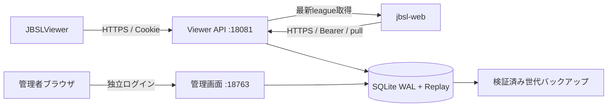

# 設計と本番運用

## 構成



`jbsl_score/service.py` が予約・結果・返却・取消復元を担当し、HTTP層やprovider層と分離しています。`api.py` と `admin.py` は別アプリで、APIポートに管理用ルートを登録していません。`python -m jbsl_score run` は両ポートを事前bindし、片方の起動失敗時はもう片方も終了します。Ctrl+Cでは両方を停止して処理中リクエストの完了を待ちます。

SQLiteはローカルディスクに置き、WAL、foreign_keys、`synchronous=FULL`、busy timeoutを使用します。短い書込みトランザクションで使用回数と結果の整合性を維持します。外部HTTP取得やmultipart読込み・BSOR解凍中にSQLite全体の書込みロックを保持しません。

同一予約キー・同一challengeにはWindowsの`msvcrt`/POSIXの`flock`で排他します。OSロックはプロセス異常終了で解放されます。結果読込みを待つリクエストはasyncで待機し、ワーカースレッドを占有しません。未提出の期限処理も同じchallengeロックを使うため、検証中の結果を途中でabandonedにしません。ファイル名は内部キーのSHA-256のみです。

ReplayをgzipのBLOBとしてDBへ保存することで、Replayだけ残る・DBだけ受理済みになる二重保存の問題を避けます。結果、Replay、回数返却、差分イベント、受領応答は同時にcommitされます。バックアップも1つのSQLiteファイルで完結します。元のReplayや結果の自動間引きはしません。

## 運用範囲

単一ホスト・ローカルSSD・少人数～数十人規模の大会運営を想定します。HTTP要求数や譜面数だけで一定の処理能力を保証するものではありません。Replayの大きさ、提出集中、ディスク性能を含めて実際の大会規模に合わせて監視してください。テストで100件の同時予約、100件の結果再送、4プロセスからの競合を検証します。

サポートする起動構成は1データディレクトリあたり1つのランチャーです。別ホスト間でSQLiteやロックディレクトリを共有しないでください。共有フォルダ・NAS・同期ドライブ上のDB、複数ホスト冗長化は対象外です。規模を広げる場合はPostgreSQL等のDBとオブジェクトストレージへ移行し、同じトランザクション・冪等性の契約を保ってください。

OS時刻はUTCへ正しく同期してください。管理画面はブラウザのタイムゾーン表示、DB/APIはUTCです。ユーザー操作でPCをスリープさせない運用設定にします。

## HTTPSの設定

公開時はAPIの `api_public_url` を実際のHTTPS originへ設定します。一般的な構成は、HTTPSを終端するリバースプロキシを同一ホストへ置き、APIの `127.0.0.1:18081` だけへ中継するものです。

```json
{
  "api_host": "127.0.0.1",
  "api_port": 18081,
  "api_public_url": "https://scores.example.com",
  "admin_host": "127.0.0.1",
  "admin_port": 18763,
  "admin_public_url": "http://127.0.0.1:18763",
  "allow_http_loopback": true,
  "trusted_proxy_ips": "127.0.0.1"
}
```

この例の項目を `config.json` に反映します。プロキシは元のHostを維持し、`X-Forwarded-Proto: https` を正しく送信してください。信頼するプロキシは個別のアドレスに限定し、`*` は設定できません。要求サイズ上限は18 MiB程度、本文・応答タイムアウトは90秒以上に設定し、アプリ側のさらに厳密な容量・読込み期限も維持します。結果PUTを別の結果へ書き換えるリトライ設定は行いません。

直接TLSを使う場合は `ssl_certfile` と `ssl_keyfile` にPEMファイルを指定し、API・管理画面の両方のpublic URLをHTTPSにします。証明書はその公開名に対して有効なものを用意します。HTTPで外部アドレスへbindする構成、HTTPS指定なのにTLS/信頼プロキシが未設定の構成は起動時に拒否します。

管理画面はlocalhostで利用するか、VPN/SSH等で到達性を限定します。管理画面も公開する場合は管理用の別HTTPS originと個別のプロキシルールを設定し、管理listenerに中継してください。管理画面をAPIのルートとして混在させません。

## ログイン不要のランキング閲覧

ログイン画面の「ランキング表示（ログイン不要）」リンク、または管理listenerの `/admin/rankings/` を開きます。既定URLは `http://127.0.0.1:18763/admin/rankings/` です。リーグ・譜面を選ぶと、順位、表示名・SID、最高スコア・精度、残回数、提出日時・結果、回数上限・曲時間を確認できます。

各行の「リプレイ」列に小さな3操作を横並びで表示します。「DL」でgzip圧縮BSOR（`.bsor.gz`）をダウンロードし、「BeatLeader」「ArcViewer」でそのプレイを別タブで再生します。正式な操作名はマウスを重ねたときにも確認できます。Replay欠落時は「リプレイなし」、HTTPS未設定時はダウンロードだけが有効になります。最新情報はブラウザの再読み込みで取得します。「ログイン画面へ」リンクから管理ログインへ戻れます。集計は管理者ランキングと同じで、正常なランキング閲覧では上流通信・スコアや回数の変更・セッション作成を行いません。

公開Replayはログイン不要で、取得時点でランキングに採用されている提出に限ります。取消・自己ベスト更新で外れた提出の古いリンクは404になります。画面を再読み込みして現在のプレイを選んでください。公開Replayの取得・プリフライトはIPごと合計120回/分です。

ページと公開API `/admin/api/public/rankings` は `admin_public_url` 配下で提供します。到達できるネットワーク範囲は管理listenerの待受・プロキシ設定に従います。既存管理APIの認証は維持されます。稼働中のサーバへこの変更を適用するにはサーバを再起動してください。

## 強制終了・手動返却の運用

「ユーザー」→「提出状況を確認」のチャレンジ行で「強制終了」または「1回返却」を選び、対象と操作理由を確認して実行します。強制終了は予約済み・プレイ中に使用でき、同時返却のチェックは初期OFFです。返却なしで強制終了した場合、後からの保守処理でも自動返却しません。必要になった場合は終了済み行から1回返却してください。

手動返却は予約時の自動返却設定にかかわらず実行でき、提出済みスコア・Replay・ランキング採否を維持します。自動・手動を合わせて1Challengeにつき最大1回です。チャレンジ単位のOSロックとDBトランザクションで提出・保守処理・返却を排他し、状態・回数・操作履歴・必要な差分イベントを同時に保存します。

監査の `challenge_force_ended` と `attempt_refunded` で管理者名・理由・変更前後を確認できます。結果提出が先に完了した場合は強制終了を409で拒否します。対象が強制終了済みなら再送は現在値を返し、返却の指定だけ変更しても追加処理しません。返却済みへの再送も回数・履歴を増やしません。

この機能は参加者のゲームやViewerの送信待ち記録を遠隔操作するものではありません。サーバの受付を終了し、次の開始通知・結果提出には再送不可のエラーを返します。稼働中のサーバへの更新適用には再起動と管理画面の再読み込みが必要です。jbsl-webでイベント名を限定している場合は、提出済みへの返却イベント `attempt_refunded` を追加してください。

## 外部ビューアでの再生

提出結果の「BeatLeaderで再生」「ArcViewerで再生」で、その提出のBSORを別タブで開きます。選択したビューアへ対象Replayだけの閲覧用URLを渡します。BeatLeaderへのスコア登録は不要です。既存のgzipダウンロードも利用できます。

`api_public_url` をブラウザから到達できるHTTPS originに設定してください。HTTP設定では再生ボタンが無効になります。プロキシは管理者用の `/api/v1/replay-viewer/` と公開ランキング用の `/api/v1/public/replays/` をAPIポートへ中継し、CORS応答ヘッダーと `Cache-Control: no-store` を保持してください。ランキングページとgzipダウンロードは管理listenerで配信します。ブラウザへの別ログインを求めるプロキシ認証では外部ビューアがReplayを読み込めません。localhostやプライベートネットワークへの外部サイトからのアクセスにはブラウザ側の制約もあります。

管理者が提出結果から発行した閲覧用URLは最長10分または管理者セッションの期限まで有効です。発行元セッションのログアウト・置き換えでも失効します。URLを知った人は期限内に取得できるため転載しないでください。ビューアへ読み込み済みのデータは回収できません。期限切れの場合は提出結果からもう一度開きます。ArcViewerには `noProxy=true` を指定し、外部CORSプロキシを経由せず取得します。

公開ランキングの再生URLはトークンを使わず、現在のランキング採用を取得のたびに確認します。管理者のログアウトには影響されません。

リバースプロキシのログはこのパスのクエリ文字列を除外してください。例えばnginxの専用locationでは、`$request` / `$request_uri` / `$args` を含まないログ形式を使用し、必要な場合はクエリを含まない `$uri` を記録します。アプリケーション側は閲覧トークンや完全な閲覧URLを記録しません。監査イベント `replay_viewer_issued` には管理者・提出ID・ビューア名・有効期限を記録します。

対応する譜面と音源をビューアが取得できることも必要です。未公開・削除済みの譜面では、別途譜面ZIPの選択が必要になる場合があります。譜面ZIPの自動配信は含まれません。

DB形式は版3です。既存の版1・版2は起動時に自動移行し、閲覧トークン用テーブルを追加します。更新前にバックアップを取得してください。版3のDBを旧版サーバで開くことはできません。期限切れトークンは保守処理で削除し、バックアップ復元では管理者セッションとともに削除します。

## 認証・権限

SteamのticketはApp ID 620980としてSteam Web APIで検証し、Oculusは現行Viewerのアクセストークンから `graph.oculus.com/me` のIDを取得します。設定キーやproviderからの実アクセス許可が必要です。providerの仕様・利用条件が変わった場合は `upstream.py` と対応テストを更新します。外部HTTPはタイムアウト・応答サイズ制限付き、リダイレクト追従なしです。

管理パスワードはsalt付きscrypt、Cookieとサービス用トークンは256bit以上の乱数とSHA-256ハッシュ保存です。パスワードの復旧はローカルCLI `set-admin` を使い、その管理者の既存セッションも失効させます。公開のパスワード再設定ルートは設けません。管理者は1つの運営権限を持ち、詳細な権限分離は対象外です。

OS上の `data` と `config.json` はサーバ実行ユーザーと運用管理者だけに読み書きを許可してください。Webのstaticフォルダやプロキシの公開ディレクトリに置かないでください。環境変数による秘密情報はDB・バックアップに含まれません。ticket・Cookie・Authorization・Replay本文はアプリログへ出力しません。プロキシでも認証ヘッダー・本文をログに記録しない設定にします。

## バックアップと復旧

既定では24時間間隔・7世代、起動時にも前回からの経過を確認します。オンラインバックアップAPIでSQLiteを一貫した状態へコピーし、`integrity_check`、外部キー、回数集計、全ReplayのSHA-256を検証します。検証成功後にファイル名を確定し、その後で古い世代を整理します。任意名の別ファイルを世代整理で削除しません。

同じディスク内の世代は操作ミスへの対策です。ディスク故障へ備えるため、作成済みのバックアップを定期的に別媒体へ複製してください。秘密設定も別のアクセス制限された手段でバックアップします。

復元手順:

1. 現行サーバを停止し、必要なら最新の `backup` を作成します。
2. `python -m jbsl_score restore <backup.sqlite3> <新しいdataディレクトリ>` を実行します。既存DBへの上書きは拒否します。
3. `config.json` の `data_dir` を復元先へ変更します。管理者パスワードは保持されますが、セッションとjbsl-web用トークンは失効します。
4. `create-token` で再発行してjbsl-web側も変更し、サーバを起動します。
5. `/readyz` と管理画面を確認します。DBを過去へ戻したため、jbsl-web側の取り込み履歴も同じ時点に合わせるか、保存済みsubmissionを再構築し、cursor=0から再取得します。

DB形式は `PRAGMA user_version` で管理し、未知の版は拒否します。初期開発版1からは予約キーの拘束情報を移行し、版1・版2から現行の版3へ閲覧トークン用テーブルを自動追加します。版変更・コード更新前にはバックアップしてください。

## 監視と保守

「操作・受信ログ」と概要の最近のログには、所要時間をミリ秒で表示します。受付・操作開始からログ記録までの時間で、受信・上流通信・処理待機を含みます。過去の未計測ログは「—」です。正常・拒否・管理操作・自動期限処理・バックアップで同じ単位を使います。新しい表示を反映するにはサーバを再起動し、管理画面を再読み込みしてください。

`/healthz` の生存、`/readyz` のDB/空き容量を監視します。管理画面の上流エラー・バックアップ失敗、`data/logs/server.log` を確認します。ログは5 MiB×5世代でローテーションし、DB内の監査履歴は保持します。DB・Replayは削除しないため、大会終了後はバックアップと保存期間の運用方針を決めてください。

プロセス自体のOSによる自動再起動は、Windowsタスクスケジューラや既存のサービス管理基盤へ `start.bat` を登録して構成します。事前に管理者作成と依存関係導入を完了し、実行ユーザーのPython・データ権限を確認してください。開発用の自動reloadは使用しません。

不正な結果はランキングに採用せず、拒否内容を監査します。ただし、このサーバはクライアントのプレイ軌跡から得点を完全再計算する不正プレイ検出エンジンではありません。BSORの構造・本人・譜面・スコア整合性を検証し、記録を保全して運営が取消・復元できる範囲を担当します。

## 参照資料

- [FastAPI deployment](https://fastapi.tiangolo.com/deployment/)
- [Uvicorn settings](https://www.uvicorn.org/settings/)
- [Steam AuthenticateUserTicket](https://partner.steamgames.com/doc/webapi/ISteamUserAuth)
- [Meta account linking / graph.oculus.com/me](https://developers.meta.com/horizon/documentation/native/ps-account-linking/)
- ワークスペース `docs/` のQualifier仕様、および現行ViewerのC#実装

`contracts.py`, `metadata.py`, `replay.py` は既存 `mock_servers` の契約検証・BSOR読取りを参照して、このサーバ内で独立して整備しています。実行時にmock実装やBeat Saberを読み込みません。

## Linux / systemd での起動・停止

Debian 12 / Python 3.13では、Windowsのbatを使わず、各アプリ専用の仮想環境を作ります。このアプリのフォルダで実行してください。uvは導入済みの前提です。

```bash
"$HOME/.local/bin/uv" venv --python 3.13 .venv
"$HOME/.local/bin/uv" pip install --python .venv/bin/python -r requirements.txt
.venv/bin/python -m jbsl_score init
.venv/bin/python -m jbsl_score run
```

先にconfig.jsonの公開URL・接続先と管理者を設定してください。システムPythonの変更は不要です。2アプリの仮想環境は共有しません。

`deploy/systemd/jbsl-score.service` を同梱しています。UserとWorkingDirectory・ExecStartを実際の一般ユーザー・展開先に変更し、`/etc/systemd/system/` にコピーして登録します。実行ユーザーがuvのPython本体にもアクセスできることを確認してください。

```bash
sudo systemctl daemon-reload
sudo systemctl enable --now jbsl-score
sudo systemctl status jbsl-score
sudo journalctl -u jbsl-score -n 100 --no-pager
sudo systemctl restart jbsl-score
```

両ポートの起動後に `ready` を出力します。Type=simpleのactive表示だけではアプリの準備完了を保証しないため、ログ・HTTP応答も確認します。SIGTERM・Ctrl+Cで両ポートを停止し、正常終了は0、起動失敗・想定外の待受終了・停止期限超過は非0終了です。異常終了は5秒後に再試行し、300秒内に5回の起動制限へ達すると停止します。原因修正後は `sudo systemctl reset-failed jbsl-score` と `sudo systemctl start jbsl-score` で再開します。手動stopでは自動再起動しません。

スコアのHTTP終了猶予は `request_timeout_seconds + 30` 秒です。`TimeoutStopSec` は `request_timeout_seconds + 90` 秒以上に合わせてください。 非同期の終了待ちにも上限を設けていますが、同期処理の停止を最終的に保証するのはsystemdのTimeoutStopSecです。停止期限内に完了しなかった要求の成功は保証しません。

LinuxではTIME_WAITが残っていても修正版同士の再起動が可能です。旧版はSO_REUSEADDRを使っていないため、旧版から初めて切り替える時だけ、停止後に約65秒待つ必要がある場合があります。同一ポートの二重起動は拒否します。同じdataを異なるポートで複数プロセスから操作しないでください。
